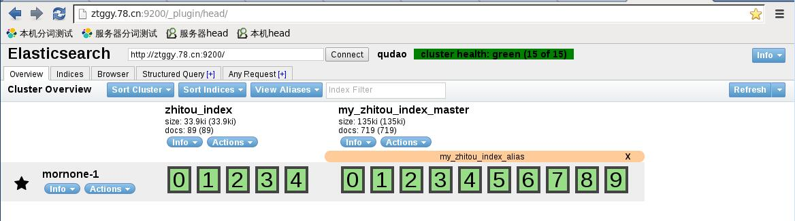
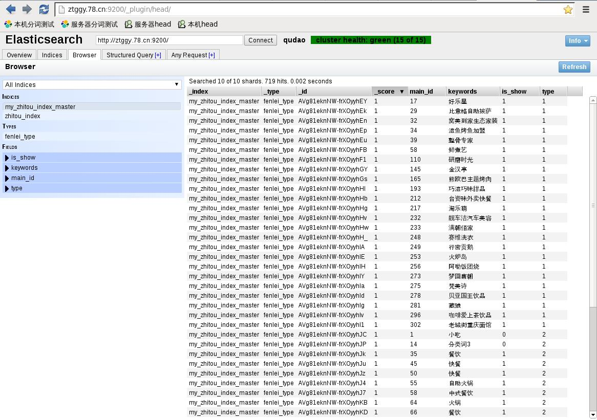
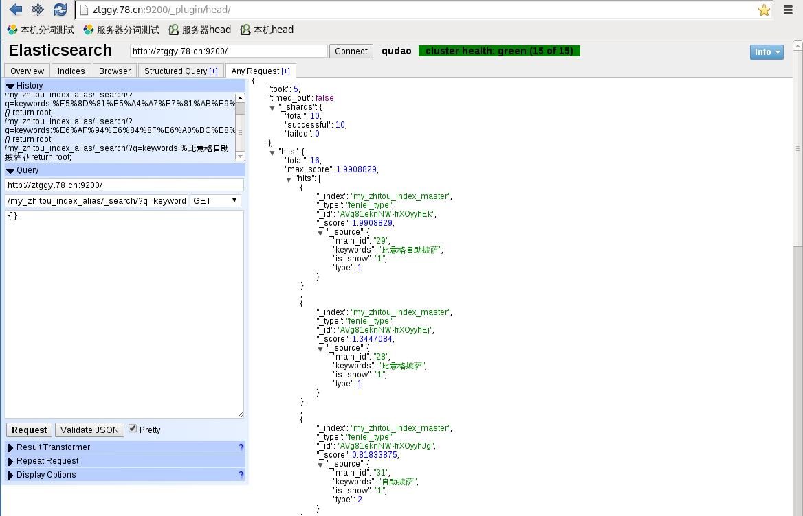
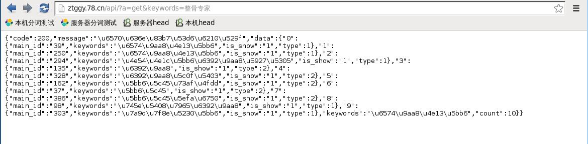

## 工作中用到的Elasticsearch案例

目前已实现在php下根据请求的语句进行分词并根据分词结果在索引中检索数据。

部分接口是通过Elasticsearch-php官方API来获取（比如：library/ElasticsearchTrait.php里的EsCreateIndex-批量创建索引，EsAddAlias-为索引添加别名），部分接口是通过直接请求Elasticsearch RESTFul API获取（比如library/ElasticsearchTrait.php里的EsGetindxByAlia-通过别名获取检索数据）。

前台是通过Elasticsearch别名机制的方式来获取数据。

目前的运行流程是：使用计划任务定时从数据源接口获取数据，然后重建索引，因为不能确定源数据接口的数据是否有更新、增加，所以目前未使用增量索引的方式，而是直接先删除原来的索引，然后拿到数据之后重建索引。

1、先建立从索引，把别名迁移到从索引

2、接着删除主索引，然后重新建立主索引，并把别名迁移到主索引

3、删除从索引以备下一次重复该流程


使用composer安装verdor目录代码,包含Elasticsearch PHP官方代码库，以及Log4php代码
直接使用如下命令安装

```
composer install
```

#### 准备工作
[安装java环境](readme/3.md)，安装[Elasticsearch](readme/2.md)，[安装head数据展示插件](http://mobz.github.io/elasticsearch-head/)，[安装ik中文分词插件](readme/1.md)。


#### 安装完成之后
跟目录下的几个php文件都是测试文件，通过访问[/api/?a=get&keywords=整骨专家](/api/?a=get&keywords=整骨专家)测试结果是否正常。









#### 参考文档

[Using Elasicsearch with php](https://www.simplicity.be/article/using-elasticsearch-php/)

[Using Elasticsearch with PHP a simple guide](http://www.web-development-blog.com/archives/using-elasticsearch-with-php/)

[可用的简单的稳定的php导数据至elasticsearch代码](http://www.cnblogs.com/wenzhilin/p/3534700.html)

[elasticsearch安装记录 ](http://blog.csdn.net/gongzi2311/article/details/51699798)

[PHP ElasticSearch的使用](http://blog.csdn.net/rongyongfeikai2/article/details/37911871)

[**==网站基于ElasticSearch搜索的优化笔记 PHP==**](http://www.open-open.com/lib/view/open1404912972950.html)

[Elasticsearch安装使用教程](http://www.linuxidc.com/Linux/2015-02/113615.htm)

[elasticsearch插件三—— Marvel插件安装详解](http://blog.csdn.net/laoyang360/article/details/51472902)

[elasticsearch插件六—— 分词 IK analyzer插件安装详解](http://blog.csdn.net/laoyang360/article/details/51472953)

[How to use 'OR' in elasticsearch PHP](http://stackoverflow.com/questions/24254881/how-to-use-or-in-elasticsearch-php)

[**==Elastic中文社区==**](http://elasticsearch.cn/)

---
[ElasticSearch中IK配置](http://blog.sina.com.cn/s/blog_6f3ff2c90102vwkd.html)

[ElasticSearch安装ik分词插件](https://my.oschina.net/xiaohui249/blog/232784)

[elasticsearch 口水篇（1）安装、插件](http://www.cnblogs.com/huangfox/p/3541300.html)

[elasticsearch-head](http://mobz.github.io/elasticsearch-head/)